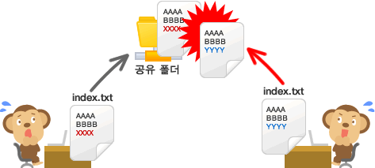

# Git & Github

## Git

### 1. `Git`의 배경

* 기존의 중앙분산 시스템에서는 중앙 서버에 문제가 발생하면 해당 서버를 이용하는 이용자 모두에게 문제가 발생하였음
* 마찬가지로 파일을 어떠한 규칙성 없이 변경하는 등의 방법으로 관리하면 추후, 해당 파일의 history를 트래킹하기 어려움
* 이를 극복하기 위한 것이 Git과 같은 버전 관리 시스템



### 2. `Git`이란?

- `Git`이란 소스코드를 효과적으로 관리하기 위해 개발된 '분산형 버전 관리 시스템'.
- `Linux` 소스코드를 관리할 목적으로 개발되었음.
- `Git` 에서는 소스 코드가 변경된 이력을 쉽게 확인할 수 있음.
- 또한, 특정 시점에 저장된 버전과 비교하거나, 특정 시점으로 되돌아갈 수 있음


> 출처 : [Backlog](https://backlog.com/git-tutorial/kr/intro/intro1_1.html) `https://backlog.com/git-tutorial/kr/intro/intro1_1.html`


### 3. GIT 명령어 Cheating Sheet

#### 1) Git - Github 연결 (User)

##### 한번만 해도 되는 작업

`git config --global user.name <username>` :  username 등록

`git config --global user.name` :  username 확인

`git config --global user.email <email>` : email 등록

`git config --global user.email` : email 확인

<br>

#### **2) Git - Github 연결 (Repository)**

##### **⭐️Repository 연결할때는 한번만 해도 되는 작업⭐️**

`git init` : git 시작

`git remote add origin <git repository url>` : repository 연결

##### **파일 수정, 생성, 삭제 할때마다 해야하는 작업!!! == 뭐든 할때마다**

`git add .` : 모든 파일 staging area에 올리기

`git add <file_name>` :  파일 staging area에 올리기

`git commit -m '<commit message>'` : 커밋 message 작성

`git push origin master` : github로 밀어내기!

`git pull` : github에서 로컬로 당겨오기!

#### 3) 6/16 수업 필기

- `git config --global user.name <user_name>` : username

- ```
  git config --global user.email <email>
  ```

   : email

  - config는 내 로컬과 깃헙 계정을 연결시켜줄 때 1회만!!!!

- ```
  git init
  ```

   : 레포를 만들고 워킹 디렉토리랑 연결시켜줄때 최초 1회

  - 레포 만들때마다!
  - 여러분들이 레포를 만들때마다 계속 해주셔야한다.

- ```
  git status
  ```

   : 워킹 디렉토리에 어떤 변화가 있는지 알아보는 명령어.

  - 워킹 디렉토리 단계와 스테이징 에리아 단계의 변화

- `git add` + `.` : 전체 다 staging area로 올리기

- ```
  git add
  ```

   \+ 

  ```
  파일명.확장자
  ```

   : 이것만 올려

  - ex) `git add 파일1 파일2 파일3`

- ```
  git commit
  ```

   \+ 

  ```
  m
  ```

  ```
  "commit message"
  ```

  - 되도록 명령어로 적기
    - 동사형으로 시작하기
    - 영어로 적기
  - 약속일뿐 법은 아니다.

- ```
  git log --oneline
  ```

   : `` (하이픈) 두개입니다.

  - `commit`된 상황에서 어떤 메시지로 언제 뭐가 올라갔는지 알기위한 명령어

- ```
  git remote add
  ```

   \+ 

  ```
  origin <github 주소>
  ```

   : 내 워킹 디렉토리와 레포지토리 연결

  - `git remote -v` : 리모트가 잘 들어갔는지 확인

- `git push` + `origin master` : 최종으로 깃헙에 올린다!!!

1. `git config --global user.name / email` 잘 적었는지 확인

2. ```
   git remote 확인
   ```

   - `git remote add origin <깃헙 주소>`

3. `git add` 했는지

4. `git commit` 잘 했는지 확인


#### Github에서 파일 삭제하기

1. 워킹디렉토리(즉, 로컬)에서 파일/폴더 삭제2

2. git add . 
3. git commit -m '<commit message> 
4. git push origin master  삭제된 로컬 환경 깃헙에 반영

> 출처: [Multicampus 오지혜 교수님 특강](https://www.notion.so/GIT-Cheating-Sheet-9988a27210f2468a9878ff89782e7970#69d5dda8729b4bdeb5d15ede539875d4)
